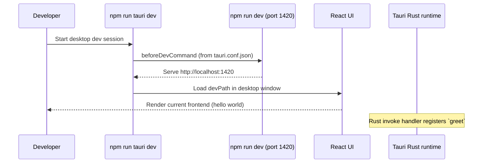

# Neo

> A minimal desktop app starter built with **Tauri + React + TypeScript + Vite**.


Neo is a lightweight foundation for shipping desktop software with web UI ergonomics. The current implementation is intentionally small: a React UI (`hello world`) running inside a Tauri shell, with a Rust command wired through Tauri's invoke handler.

## Why this project exists

This repository provides a clean baseline for developers who want to:

- Build desktop apps with a web frontend
- Keep a Rust backend entry point available for native commands
- Iterate quickly with Vite in development and Tauri bundling for release artifacts

## Problem, target users, and current capabilities

| Area | Current state (implemented) |
| --- | --- |
| Problem addressed | Bootstrapping a desktop app stack without wiring React/Vite/Tauri from scratch |
| Target users | Developers starting a Tauri desktop application |
| UI capability | Renders a Tailwind-styled `hello world` view from `src/App.tsx` |
| Native capability | Registers a Rust `greet(name)` Tauri command in `src-tauri/src/main.rs` |
| Packaging | Tauri bundle is active with `targets: "all"` and standard icon set |

## Technology stack

- **Frontend:** React 18, TypeScript 5, Vite 5
- **Desktop shell:** Tauri v1 (`@tauri-apps/cli`, Rust `tauri` crate)
- **Styling/tooling:** Tailwind CSS, PostCSS, Autoprefixer
- **Language/runtime:** Node.js (for frontend toolchain), Rust (for Tauri app)

## Architecture

> Boundaries marked as **inferred** represent integration seams between frontend and Tauri/Rust layers.

```mermaid
flowchart LR
  subgraph FE[Frontend (Vite + React)]
    H[index.html] --> M[src/main.tsx]
    M --> A[src/App.tsx]
    A --> T[Tailwind utility classes]
  end

  subgraph DT[Desktop Shell (Tauri + Rust)]
    R[src-tauri/src/main.rs]
    G[greet(name) -> String]
  end

  A -. inferred invoke boundary .-> API[@tauri-apps/api]
  API -. inferred IPC boundary .-> R
  R --> G
```

### Development lifecycle / event flow



### Packaging and runtime boundaries

```mermaid
flowchart TD
  SRC[Source: src + src-tauri] --> FB[npm run build]
  FB --> DIST[dist/ frontend assets]
  DIST --> TB[npm run tauri build]
  TB --> BUNDLE[Tauri bundle (active: true, targets: all)]
  BUNDLE --> OS[Host OS package formats]
```

## Repository structure

```text
/home/runner/work/Neo/Neo
├── src/                     # React frontend
│   ├── App.tsx              # Current UI entry content
│   └── main.tsx             # React root bootstrap
├── src-tauri/
│   ├── src/main.rs          # Tauri app + Rust command registration
│   ├── tauri.conf.json      # Tauri build/dev/window/bundle config
│   ├── Cargo.toml           # Rust dependencies/features
│   └── icons/               # Desktop app icons
├── public/                  # Static web assets
├── package.json             # npm scripts + JS dependencies
├── vite.config.ts           # Vite dev config (fixed port 1420)
└── tailwind.config.js       # Tailwind content scanning paths
```

## Prerequisites

- **Node.js + npm** (required for Vite/React toolchain)
- **Rust toolchain** (required by Tauri build)
- **Tauri system prerequisites** for your OS: <https://v1.tauri.app/v1/guides/getting-started/prerequisites>

## Installation

```bash
npm install
```

## Environment and configuration

No `.env` variables are consumed by the current codebase.

Key project configuration lives in:

- `/home/runner/work/Neo/Neo/src-tauri/tauri.conf.json`
- `/home/runner/work/Neo/Neo/vite.config.ts`
- `/home/runner/work/Neo/Neo/tailwind.config.js`

### Important configuration values

| File | Key | Value |
| --- | --- | --- |
| `src-tauri/tauri.conf.json` | `build.beforeDevCommand` | `npm run dev` |
| `src-tauri/tauri.conf.json` | `build.beforeBuildCommand` | `npm run build` |
| `src-tauri/tauri.conf.json` | `build.devPath` | `http://localhost:1420` |
| `src-tauri/tauri.conf.json` | `build.distDir` | `../dist` |
| `vite.config.ts` | `server.port` | `1420` |
| `vite.config.ts` | `server.strictPort` | `true` |
| `src-tauri/tauri.conf.json` | `tauri.allowlist.shell.open` | `true` |
| `src-tauri/tauri.conf.json` | `tauri.security.csp` | `null` |

## Commands

All available scripts are defined in `package.json`:

| Command | What it does |
| --- | --- |
| `npm run dev` | Starts Vite dev server |
| `npm run build` | Runs TypeScript compile check (`tsc`) then Vite production build |
| `npm run preview` | Serves built frontend locally |
| `npm run tauri` | Runs Tauri CLI commands |
| `npm run tauri dev` | Starts desktop app in development mode |
| `npm run tauri build` | Builds desktop bundles via Tauri |

### Lint / typecheck / test status

- **Lint:** No lint script is currently defined.
- **Typecheck:** Performed inside `npm run build` via `tsc`.
- **Tests:** No test script or test framework is currently configured.

## Desktop packaging and release guidance

Current configuration supports desktop bundling through Tauri (`bundle.active: true`, `targets: "all"`). In practice, artifact formats depend on the host OS and installed toolchains.

Generic release checklist:

1. Ensure OS-specific Tauri prerequisites are installed.
2. Run `npm run tauri build` on the target OS.
3. Validate generated installers/binaries from Tauri output.
4. Verify app metadata (`productName`, `version`, icons) before distribution.

## Security, accessibility, performance, and operations notes

### Security (current vs hardening)

- **Current:** Tauri allowlist keeps `all: false`, but enables `shell.open`.
- **Current:** CSP is explicitly `null` in Tauri config.
- **Recommended hardening:** tighten shell usage and define a restrictive CSP before production release.

### Accessibility

- Current UI is a single text node; no dedicated accessibility audit tooling is configured yet.

### Performance

- Stack is minimal and suited for fast local iteration; no performance instrumentation is configured.

### Operations

- No CI/CD workflows or observability tooling are defined in this repository at this time.

## Contributing

1. Fork and clone the repository.
2. Install dependencies: `npm install`
3. Develop with either:
   - `npm run dev` (frontend only), or
   - `npm run tauri dev` (desktop + frontend)
4. Build before opening a PR: `npm run build`
5. Keep changes focused and document behavior changes in README as needed.

## Troubleshooting

<details>
<summary><strong>Port 1420 is already in use</strong></summary>

`vite.config.ts` sets `strictPort: true`, so startup fails if `1420` is occupied. Stop the conflicting process, then rerun.
</details>

<details>
<summary><strong>Tauri build fails on a clean machine</strong></summary>

Verify Rust toolchain and OS prerequisites from Tauri docs are installed, then retry `npm run tauri build`.
</details>

<details>
<summary><strong>Desktop window loads but frontend is blank</strong></summary>

Confirm `npm run dev` works independently and that `http://localhost:1420` is reachable, since Tauri uses that `devPath` during development.
</details>

## Roadmap (concise)

- Replace placeholder UI with product-specific screens and routing
- Connect frontend to Rust commands through `@tauri-apps/api` invoke calls
- Add linting and automated tests
- Define production security policy (CSP + stricter allowlist)

## License

No license file is currently present in this repository. Add a `LICENSE` file before public distribution.
